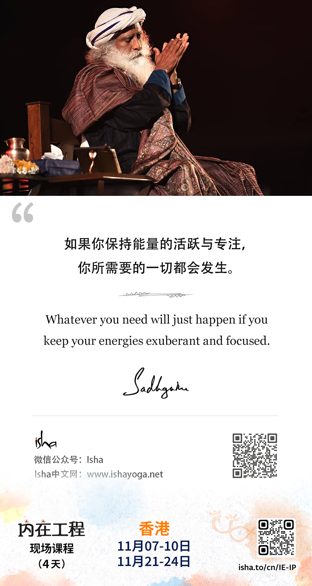
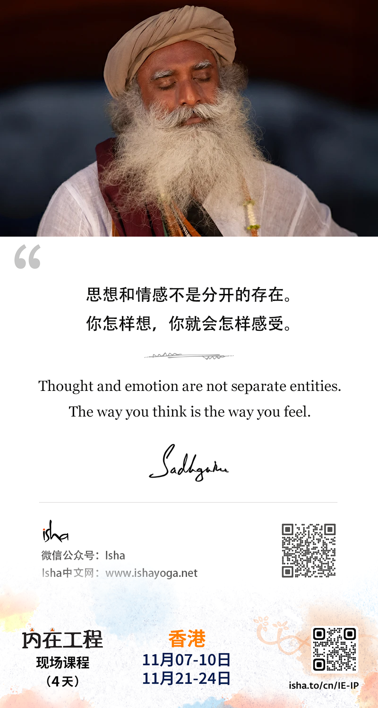
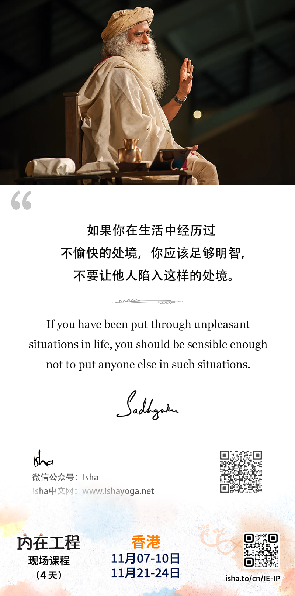
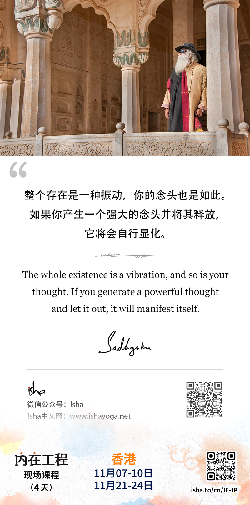
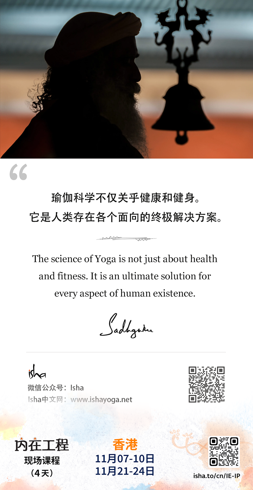
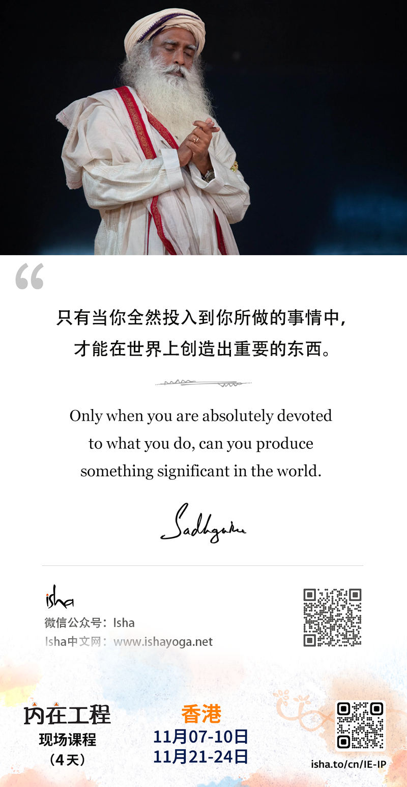
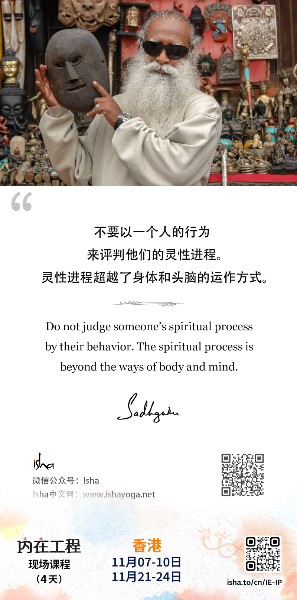

> **2024年11月**
---
- 11月1日
- 一切运动之物终会耗尽，唯有静者永恒。冥想本质上就是朝向这种静，成为存在的核心。
- All that moves will exhaust itself. Only that which is still, is for always. Meditation is essentially to move towards that stillness, to become like the core of existence.
---

---
- 11月2日
- 让生命美好的不是你做了多少，而是你如何去做。
- It is not how much you do - how you do it is what makes life beautiful.
---

---
- 11月3日
- 无论你体验到压力、愤怒、恐惧，或任何其他的消极性，其根本原因只有一个：对自己的内在本性一无所知。
- Whether you experience stress, anger, fear, or any other kind of negativity, there is only one basic cause: being ignorant of your inner Nature.
---

---
- 11月4日
- 如果你保持能量的活跃与专注，你所需要的一切都会发生。
- Whatever you need will just happen if you keep your energies exuberant and focused.
---

---
- 11月5日
- 思想和情感不是分开的存在。你怎样想，你就会怎样感受。
- Thought and emotion are not separate entities. The way you think is the way you feel.
---

---
- 11月6日
- 如果你在生活中经历过不愉快的处境，你应该足够明智，不要让他人陷入这样的处境。
- If you have been put through unpleasant situations in life, you should be sensible enough not to put anyone else in such situations.
---

---
- 11月8日
- 整个存在是一种振动，你的念头也是如此。如果你产生一个强大的念头并将其释放，它将会自行显化。
- The whole existence is a vibration, and so is your thought. If you generate a powerful thought and let it out, it will manifest itself.
---

---
- 11月9日
- 瑜伽科学不仅关乎健康和健身。它是人类存在各个面向的终极解决方案。
- The science of Yoga is not just about health and fitness. It is an ultimate solution for every aspect of human existence.
---

---
- 11月10日
- 只有当你全然投入到你所做的事情中，才能在世界上创造出重要的东西。
- Only when you are absolutely devoted to what you do, can you produce something significant in the world.
---

---
- 11月11日
- 不要以一个人的行为来评判他们的灵性进程。灵性进程超越了身体和头脑的运作方式。
- Do not judge someone's spiritual process by their behavior. The spiritual process is beyond the ways of body and mind.
---
