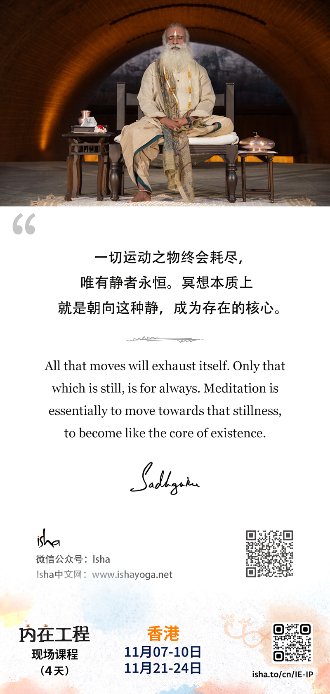
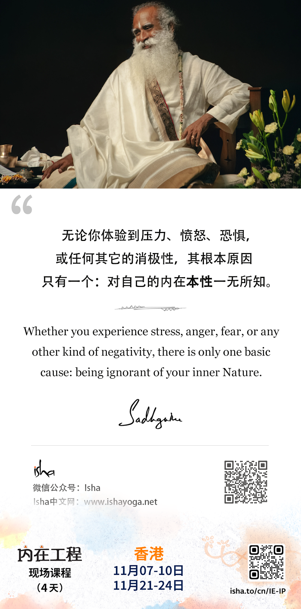

> **2024年11月**
---
- 11月1日
- 一切运动之物终会耗尽，唯有静者永恒。冥想本质上就是朝向这种静，成为存在的核心。
- All that moves will exhaust itself. Only that which is still, is for always. Meditation is essentially to move towards that stillness, to become like the core of existence.
---

---
- 11月2日
- 让生命美好的不是你做了多少，而是你如何去做。
- It is not how much you do - how you do it is what makes life beautiful.
---

---
- 11月3日
- 无论你体验到压力、愤怒、恐惧，或任何其他的消极性，其根本原因只有一个：对自己的内在本性一无所知。
- Whether you experience stress, anger, fear, or any other kind of negativity, there is only one basic cause: being ignorant of your inner Nature.
---
