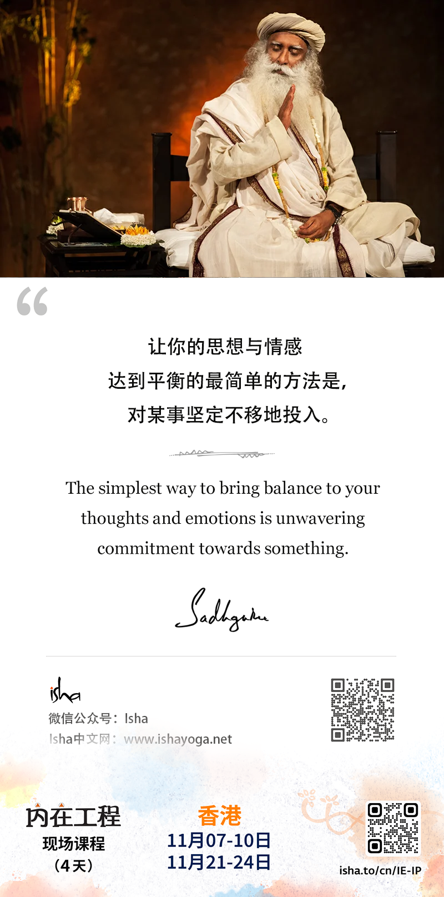
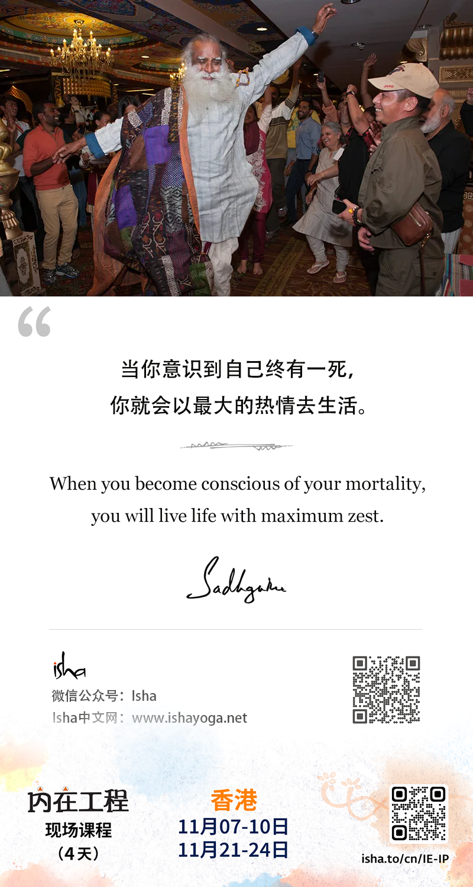
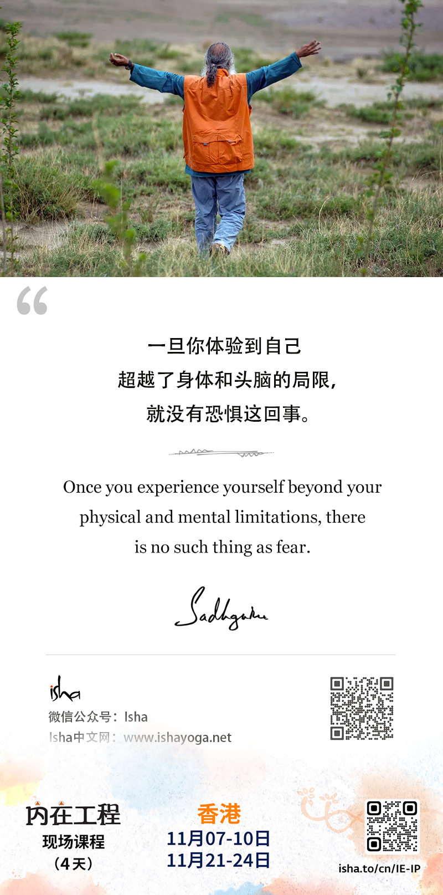
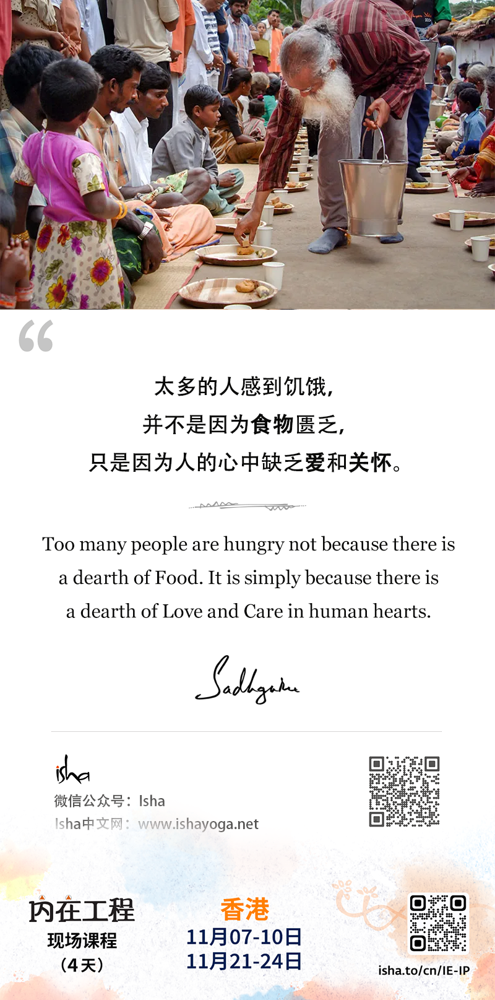
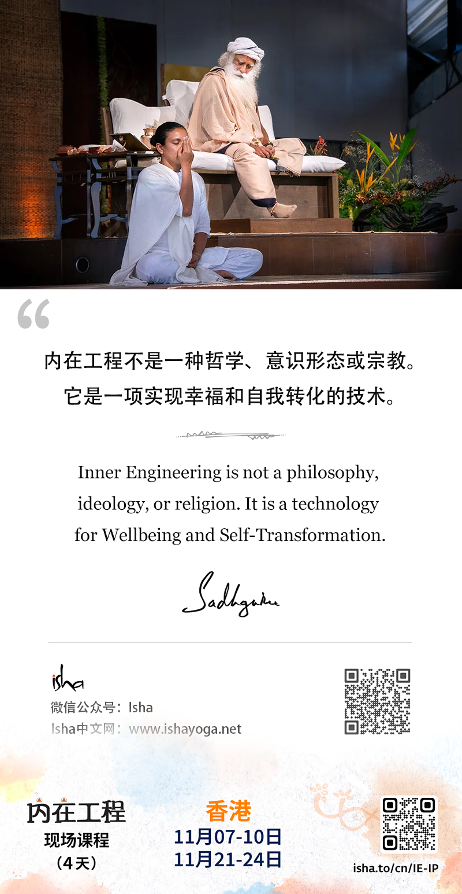

> **2024年10月**

---
- 10月12日
- 生命是重要的。生活方式则是我们所处时代的结果。
- Life is important. Lifestyle is a consequence of the times we live in.
---

---
- 10月13日
- 让你的思想与情感达到平衡的最简单的方法是，对某事坚定不移地投入。
- The simplest way to bring balance to your thoughts and emotions is unwavering commitment towards something.

* unwavering：坚定不移的
* wavering：摇摆不定的
* wav(er)：波浪，摇晃
---

---
- 10月14日
- 当你意识到自己终有一死，你就会以最大的热情去生活。
- When you become conscious of your mortality, you will live life with maximum zest.

* mortality：终有一死、“必死性”、“生命的有限”、“死亡数量”或“死亡率”。
- 1. **死亡率**：指在一定时间内死亡人数与人口总数的比率。这个概念在人口统计学、流行病学、生物学等多个领域中都有应用。例如，某个地区的婴儿死亡率（infant mortality rate）或肺癌死亡率（mortality from lung cancer）。
- 2. **必死性**：指生物无法逃脱死亡的命运，这是一个哲学或概念性的用法，强调所有生物最终都会死亡的事实。例如，"The fear of mortality is a common human emotion."（对必死性的恐惧是一种普遍的人类情绪。）。
- 3. **死亡数**：在某些情况下，"mortality" 也可以直接指代死亡的人数，尤其是在讨论特定事件或疾病导致的死亡时。
- 4. **医学领域中的病死率**：在医学或健康领域，"mortality" 特指病死率，即某地区一定时期内由于某病死亡人数占该地区该时期内患有该病的人数的比例。它侧重于描述疾病在感染或确诊人群中的死亡情况。
* zest：“热情”、“风味”、“活力”、“刺激。
- 1. **热情**：指对某事的强烈兴趣或热情。例如，"She has a great zest for life."（她对生活充满热情。）
- 2. **风味**：在烹饪中，"zest" 指的是食物的强烈风味，尤其是通过添加香料或柑橘类水果的皮来增加的风味。例如，"The dish was enhanced with the zest of lemon."（这道菜因添加了柠檬皮而更加美味。）
- 3. **活力**：指充满活力或精力的状态。例如，"The team played with zest and won the game."（球队充满活力地比赛并赢得了胜利。）
- 4. **刺激**：在某些情况下，"zest" 也可以指给某物增加刺激或兴奋感。例如，"The game added zest to the evening."（游戏为这个夜晚增添了刺激。）
---

---
- 10月15日
- 一旦你体验到自己超越了身体和头脑的局限，就没有恐惧这回事。
- Once you experience yourself beyond your physical and mental limitations, there is no such thing as fear. 
---

---
- 10月16日
- 太多的人感到饥饿，并不是因为食物匮乏，只是因为人的心中缺乏爱和关怀。
- Too many people are hungry not because there is a dearth of Food. It is simply because there is a dearth of Love and Care in human hearts. 

- "Dearth"：这个词来源于古英语，意指某物的缺乏或不足。它通常用来描述数量上的短缺，尤其是在人们期望或需要更多时。

- 1. **a dearth of**：后面通常跟缺乏的对象，如"a dearth of opportunities"（机会的缺乏）。
- 2. Despite the dearth of resources, the community managed to thrive.（尽管资源匮乏，这个社区还是设法繁荣起来。）
- 3. The dearth of affordable housing is a major concern in many cities.（负担得起的住房的缺乏是许多城市的主要关切。）
---

---
- 10月17日
- 内在工程不是一种哲学、意识形态或宗教。它是一项实现幸福和自我转化的技术。
- Inner Engineering is not a philosophy, ideology, or religion. It is a technology for Wellbeings and Self-Transformation. 

	- 1.philosophy：哲学
	- 2.ideology：意识形态
	- 3.religion：宗教
	- 4.Wellbeings：幸福
	- 5.Self-Transformation：自我转化

---
