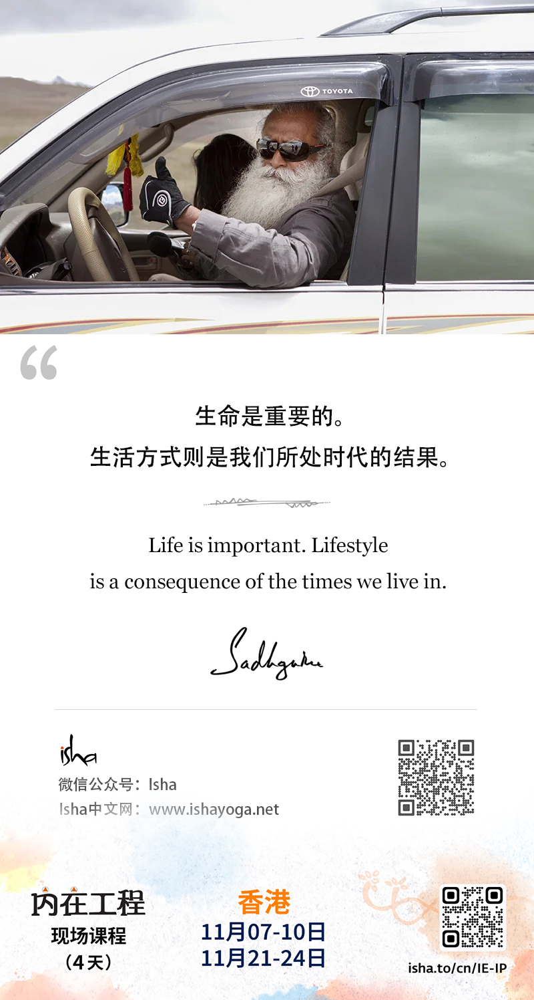

> **2024年10月**

---
- 10月12日
- 生命是重要的。生活方式则是我们所处时代的结果。
- Life is important. Lifestyle is a consequence of the times we live in.
---

---
- 10月13日
- 让你的思想与情感达到平衡的最简单的方法是，对某事坚定不移地投入。
- The simplest way to bring balance to your thoughts and emotions is unwavering commitment towards something.

* unwavering：坚定不移的
* wavering：摇摆不定的
* wav(er)：波浪，摇晃
---

